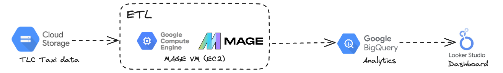

# TLC Taxi Data Analysis Project 
This project creates an ETL pipeline for TLC taxi data and then performs analytics and generates a report. The technologies involved in this project are GCP Storage, GCP Compute instance (EC2), Mage, BigQuery and Looker Studio.  

 

## Data Model 
Convert the flat CSV file into fact and dimension Tables.


## Setting up the Environment (GCP Storage and Compute Instance)
1. Create a GCP storage bucket and upload taxi data CSV files.
2. Create an EC2 VM instance and configure the VM as follows: 

``` 
#update packages
sudo apt-get update -y 

#install python3 
sudo apt-get install python3-distutils
sudo apt-get install python3-apt

# install wget
sudo apt-get install wget

#install pip
wget https://bootstrap.pypa.io/get-pip.py
sudo python3 get-pip.py 

# install mage: https://github.com/mage-ai/mage-ai 
sudo pip3 install mage-ai

#start project
mage start tlc-data-analysis
```

## ETL Pipeline (Mage)
A new pipeline is created as follows:
1. The [load.py](mage/load.py) script loads the data from the GCP storage based on the URL specified.
2. The [transform.py](mage/transform.py) script takes in the loaded data and transforms the data to be loaded into BigQuery.  
   1. Convert the flat file into fact and dimension tables (as dataframes) based on the data model above.
   2. Convert the resultant data frames into dictionaries and store them in a composite dictionary.
4. The [export.py](mage/export.py) script exports each fact/dimension table to BigQuery.
   1. Create a new service account with a BigQuery Admin role.
   2. Create a new key and update Mage configuration (utils/io_config) with key details.
   3. Install the following: `sudo pip3 install google-cloud ; sudo pip3 install google-cloud-bigquery`

## Create Analytical Layer (BigQuery)
[create_analytics_table.sql](./create_analytics_table.sql) script joins the fact and dimension tables to create the table for analytics purposes.  

## Report Generation (Looker Studio)
[Looker report](https://lookerstudio.google.com/reporting/1acd360b-6458-4e29-8c81-91144fc95d9d). The PDF version of the report can be accessed [here](TLC_data_analysis_report.pdf).
