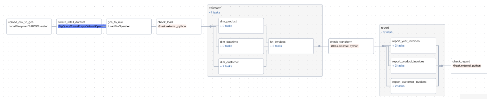
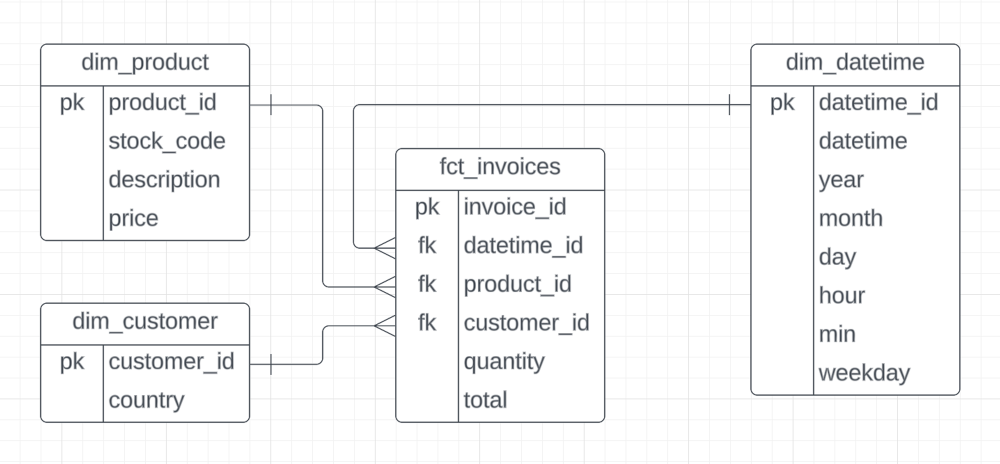
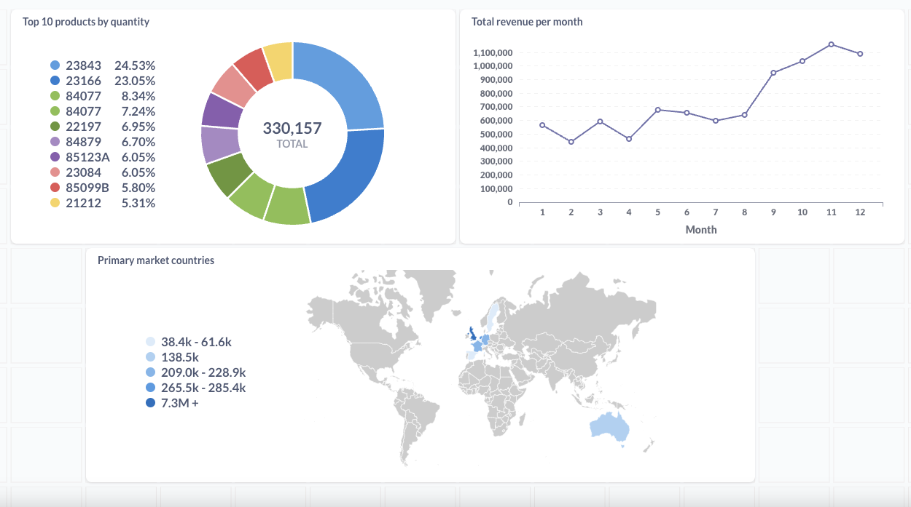

# Online Retail Data Pipeline 
This project creates a data pipeline to extract, transform and load an online retail dataset, perform data quality checking and create a dashboard. The technologies involved in this project are GCP Storage, BigQuery, Airflow, Soda, Astro CLI, Docker, dbt and Metabase.


## Primilinaries 
* Airflow is used as the orchestration tool together with Astro CLI.
     * A `Google Cloud` connection is created using Airflow → Admin → Connections. This connection is used to access all GCP services throughout this project.
     * Tasks are run in the command line. For instance, the task `upload_csv_to_gcs` is run as `airflow tasks test retail upload_csv_to_gcs 2023-12-07`. 
* Soda is used to conduct data quality checks.
    * Installation:
  ```
      # Dockerfile: install soda into a virtual environment
      RUN python -m venv soda_venv && source soda_venv/bin/activate && \
      pip install --no-cache-dir soda-core-bigquery==3.0.45 &&\
      pip install --no-cache-dir soda-core-scientific==3.0.45 && deactivate
  ```
    * Configurations: `include/soda/configuration.yml`
    * Test connection:
  ```
  astro dev bash
  soda test-connection -d retail -c include/soda/configuration.yml
  ```

* cosmos is used to integrate dbt and airflow
    * cosmos-dbt installation:
  ```
  -- requirements.txt
  astronomer-cosmos[dbt-bigquery]==1.0.3 // install google + cosmos + dbt
  protobuf==3.20.0
  ```
    * dbt installation:
  ```
    # Dockerfile: install dbt into a virtual environment
    RUN python -m venv dbt_venv && source dbt_venv/bin/activate && \
    pip install --no-cache-dir dbt-bigquery==1.5.3 && deactivate
  ```

## Pipeline


All DAG tasks shown in the above DAG graph is specified in `include/dags/retail.py`: 
1. `upload_csv_to_gcs`: extract the dataset [https://www.kaggle.com/datasets/tunguz/online-retail](https://www.kaggle.com/datasets/tunguz/online-retail) and load into a GCP storage bucket.
2. `create_retail_dataset`: create an empty dataset in BigQuery. 
3. `gcs_to_raw`: create a table named `raw_invoices` and load the dataset from the storage bucket. 
4. ` check_load()`: run data quality checks for the loaded data. Tests are in `include/soda/checks/sources/raw_invoices.yml`.  
5. `transform`: transform the data into fact and dimension tables based on the [data model](./images/data_model.png) shown below. dbt models are in `include/dbt/models/transform`
6. `check_transform()`: run data quality checks for transformed tables. Tests are in `include/soda/checks/transform/`. 
7. `report`: generate tables for analytics. dbt models are in `include/dbt/models/report`. 
8. `check_report()`: run data quality checks for analytics tables. Tests are in `include/soda/checks/report/`.

## Data Model


## Dashboard 

